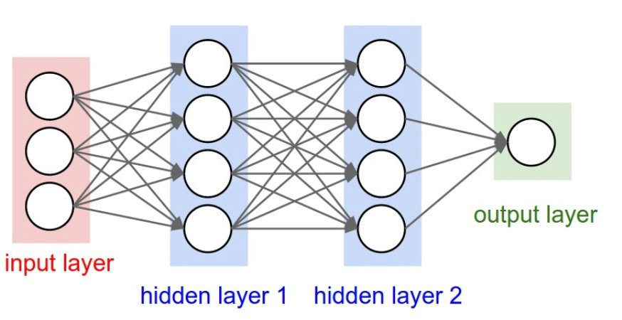
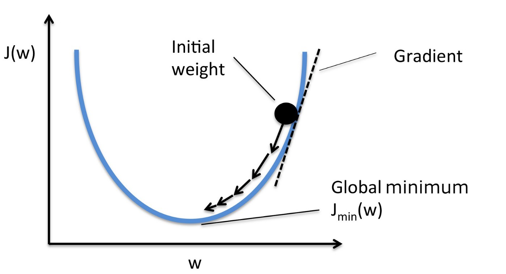

# MLP - Neural Net


While knowledge of the math behind a neural net would be preferred this isn't strictly necessary to start a beginner Neural Net implementation as most modern high-level ML frameworks such as Pytorch provides functions doing it for us. It is however needed to have some understanding of the building blocks that makes up our network and what we wish to accomplish.

## Background

### Neurons

The point in our case is to learn a mapping $f$ from input vector $\textbf{x}$ to correct output $y$ s.t. $f(\textbf{x}) = y$. The header image shows one fully connected `neuron`, as an example of a mapping. The neuron is connected to all inputs, multiplies each input by a weight $w$ and adds a scalar bias $b$. These are trainable parameters modified during training by a gradient to better fit our mapping. Finally, this is sent through an activation function to generate an output. We often use non-linear activations like `ReLU` since this makes our linear weightlayer able to learn non-linear mappings.

### Model architecture
We can stack several neurons together in a layer, and then add several layers to make the layers learn different properties of our data and thus a more complex mapping. One often uses specialized weight layers depending on the input data. Common ones are convolutions for computer vision, recurrency for timeseries and linear (fully connected) layers for numerical input. The structure of neuron widths and layers is called network model or architecture and an example architecture is shown below.  



### Forward and backward pass
Sending the input once from left to right to generate a prediction is called a `forward pass`. After the forward pass we want to alter the weights based on how "wrong" our predictions were. This is quantified by a loss function that we want to iteratively minimize. We minimize through an optimization function that calculates the gradient (steepest ascent) of the loss function w.r.t. the weights and uses its negative as the direction towards smaller loss. The amount of change in this direction is given by a manually set hyperparameter called `learning rate`. Updating the weights through this process is called `backward pass`.



Forward and backward passes are alternated for a given number of epochs while training and validation loss is monitored. The most important goal is that the model generalises well to unseen data, hence training is often discontinued when training loss keeps increasing but validation accuracy/loss starts decreasing as this is the point where the model stops learning a representation and starts memorizing the actual datapoints.

### ReLU Activation
ReLU stands for Rectified Linear Unit and its mathematical formula is very simple:
$$
max(0, z)
$$
It is 0 for negative input and mirrors its input above 0. As shown in the image below it is piece-wise linear but not in the transition at 0, which makes it able to approximate non-linear functions .


## In Pytorch
Below is a Pytorch implementation of the 3-layer fully connected model as discussed above. `in_channels` is equal to the number of input data feature dimensions, `[64, 128]` are the number of neurons in the hidden layers, and `ReLU` is used as non-linear activation function. The final layer outputs a one dimension prediction of raw logits in the range $(-\infty, \infty)$. Normally the final layer uses a separate activation function to squeeze predictions to the expected target range so the model doesn't need to learn this mapping on its own but our loss function `BCEWithLogitsLoss()` takes raw logits and performs a `sigmoid`-activation function + `BCE`. This is preferred to individual sigmoid then loss since it uses the log-sum-exp trick for numerical stability..
```python
class BinaryClassifier(torch.nn.Module):
    def __init__(self, in_channels):
        super(BinaryClassifier, self).__init__()
        
        self.linear1 = torch.nn.Linear(in_channels, 64)
        self.linear2 = torch.nn.Linear(64, 128)
        self.linear3 = torch.nn.Linear(128, 1)

        self.activation = torch.nn.ReLU()

    def forward(self, x):

        x = self.activation(self.linear1(x))
        x = self.activation(self.linear2(x))

        x = self.linear3(x)

        return x
```
Loss and Optimizer.
```python
criterion = nn.BCEWithLogitsLoss()
optimizer = torch.optim.Adam(model.parameters(), lr=learning_rate)
```

## Usage
Train the model by running the following in terminal
```
python train
```
