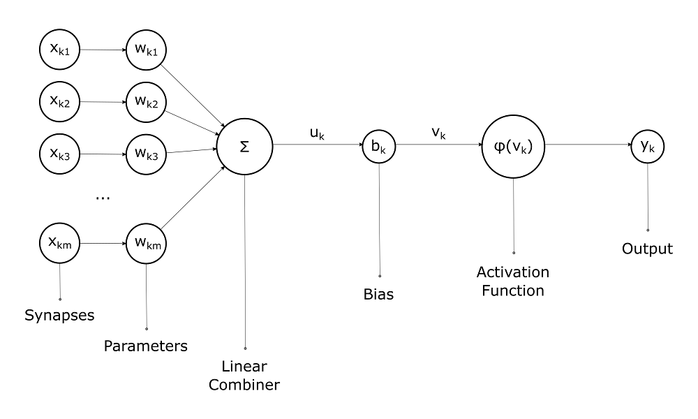

## MLP - Neural Net
While knowledge of the math behind a neural net would be preferred this isn't strictly needed to start a beginner Neural Net implementation as most modern high-level ML frameworks such as Pytorch provides functions helping us. It is however needed to have some understanding of the building blocks that makes up our network and what we wish to accomplish.

In short the point is to learn a mapping from $f(x) = y$

One often uses specialized weight layers depending on the input data. Common ones are convolutions for computer vision, recurrency for timeseries and linear (fully connected) layers for numerical input.

init weights
forward pass, 

### Activation function

prediction,
### Loss Function

### Optimizer
Adam
backward propagation, weights
